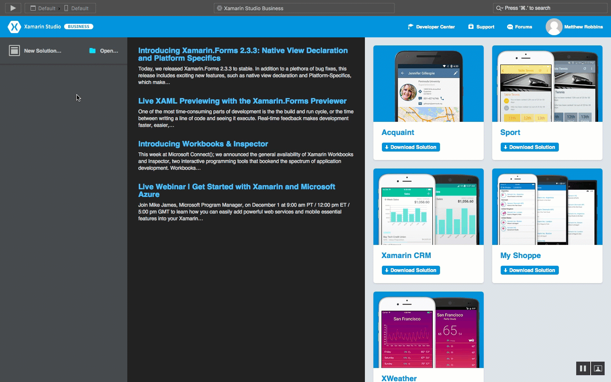
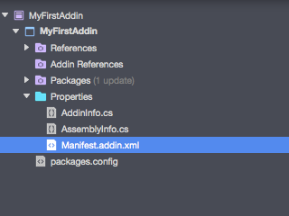

# Building Xamarin Studio Addins
**Matthew Robbins - Creator Of [MFractor](http://www.mfractor.com/)**

This repository is the accompanying source code for the Xamarin University guest lecture, **Building Xamarin Studio Addins For Xamarin Studio**.

Learn how to take an Addin from concept to deployment using the Addin Maker, Xamarin Studio and mdtool.

This source code contains a **Translate String** Addin; users can right click on a C# string literal and translate it to another language!


### Table of Contents

  * Installing the Addin Maker
  * Creating Your First Addin
  * The MonoDevelop Extension Model
  * The Addin Manifest
  * Addin References
  * Command Handlers
  * Some Essential APIs
  * Testing and Debugging
  * Packaging Your Addin
  * Publishing Your Addin
  * Resources
  * Closing Words

## Installing the Addin Maker
Let's get started by installing the Addin Maker into Xamarin Studio.

The Addin Maker is an [open source](https://github.com/mhutch/MonoDevelop.AddinMaker), freely available addin developed by [Mikayla Hutchinson](https://twitter.com/mjhutchinson) that enables development and debugging of Xamarin Studio addins *within* Xamarin Studio itself.

We can install the Addin Maker through Xamarin Studios *Addin Manager*; click on the **Xamarin Studio** main menu then **Addins..** to open the Addin Manager.

Browse to **Gallery** and then select the **Addin Development**.



If the Addin Manager's Gallery is empty (this can happen when you upgrade then downgrade Xamarin Studio), then manually add a reference to the MonoDevelop addin repository using the following URL:

[http://addins.monodevelop.com/Stable/Mac/6.1.1/main.mrep](http://addins.monodevelop.com/Stable/Mac/6.1.1/main.mrep)


## Creating Your First Addin
After installing the Addin Maker, a new project type will be available within the project creation dialog.

Select the **File** main menu item and then **New Solution**. Under **Miscellaneous** an option named **Xamarin Studio Addin** will now be present.


Go ahead and create your first addin!

## The MonoDevelop Extension Model
Before we get coding, it's very important to cover some theory.

MonoDevelop is built upon an extensible architecture known as an *Extension Model*. This architecture


## The Addin Manifest

You'll see we now have a blank project with a few files under the projects **Properties** folder:




## Project Addin References

## Command Handlers
One of the most common objects we'll create when building a Xamarin Studio addin are implementations of `CommandHandler`'s.

A `CommandHandler` is an action that can be executed within a certain context within Xamarin Studio; we register a

## Some Essential APIS
Let's dig through some of the essential APIs that you may need to use

#### IdeApp
The `MonoDevelop.Ide.IdeApp` static class is your entry point into most of Xamarin Studio. It exposes the `Workbench`, the `Workspace`, various services and life cycle methods such as when the IDE is exiting.

Typically the `IdeApp` class is used to access the `Workbench` and `Workspace`.

#### IdeApp.Workbench
The `Workbench` is used to access the documents that a developer is currently working with. We can load, create, reparse and close documents, access editor pads, access the root ide window and much much more.

One of the most commonly used properties is `ActiveDocument`. This property retrieves the current document that a user is working with. From there, we can grab the C# syntax tree, a users project or solution and then analyse or make changes to their source code.

#### IdeApp.Workspace

#### RefactoringService
When developing an Addin, we'll often want to make changes to a users source code and have undo-redo history

#### PropertyService
The static class `MonoDevelop.Core.PropertyService` is used to store user configurations for the Ide installation.

The `PropertyService` is commonly used to store configuration settings that are specific to your addin. For instance, we can store a variable that denotes if it was the addins first run using the code below:

````
if (!PropertyService.HasValue("my_addin.is_first_run")
   || PropertyService.Get("my_addin.is_first_run", true))
{
  PropertyService.Set("my_addin.is_first_run", false);
  PropertyService.SaveProperties();
}
````

Here we
 * Use `HasValue` to determine if a value is stored within the users properties.
 * Use `Get` to retrive a value from the `PropertyService`; note that we can provide a default value to return when there property does exist.
 * Use `Set` to store a new property.
 * Use `SaveProperties` to commit our changes to the properties. You **must** do this to ensure your properties are persisted between Ide sessions.

## Testing And Debugging


## Packaging Your Addin
Before we send out our addin into the big, wide world it's best practice to verify everything works as a final app package.

Xamarin Studio addins are distributed in the `.mpack ` format; this is a zip archive that contains all your Addin assemblies and resources in a convenient bundle.


## Publishing Your Addin
Xamarin Studio addins can be

## Resources

## Closing Words
