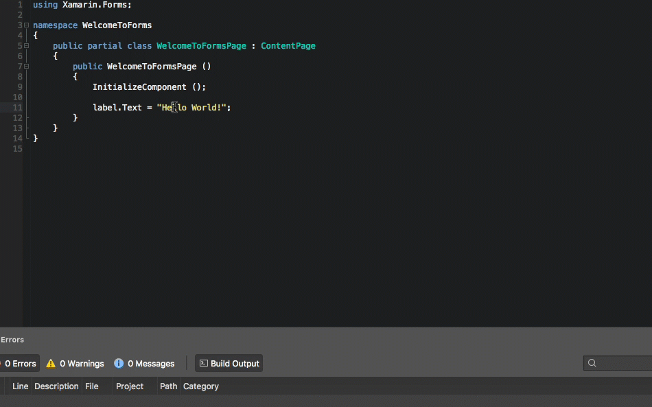
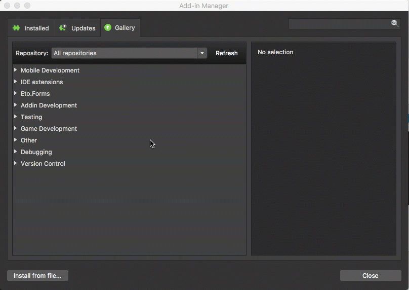
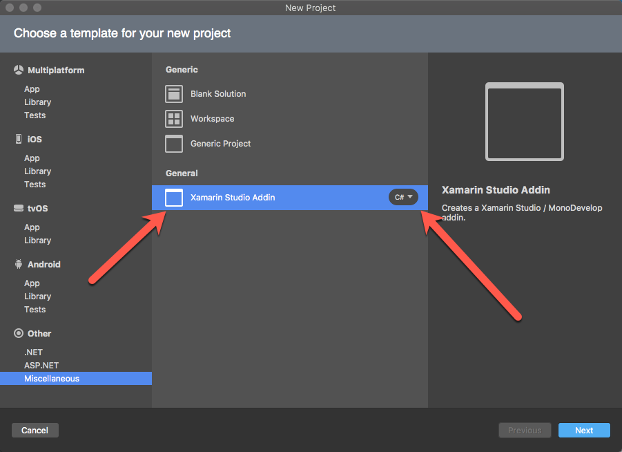
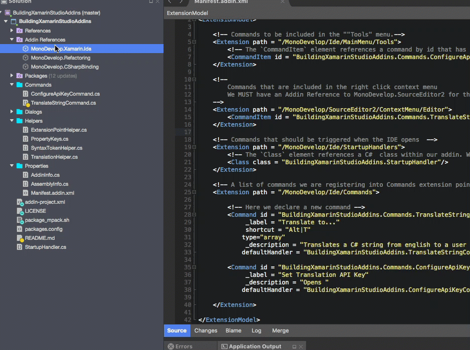
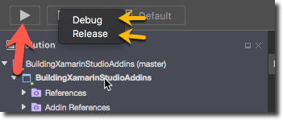
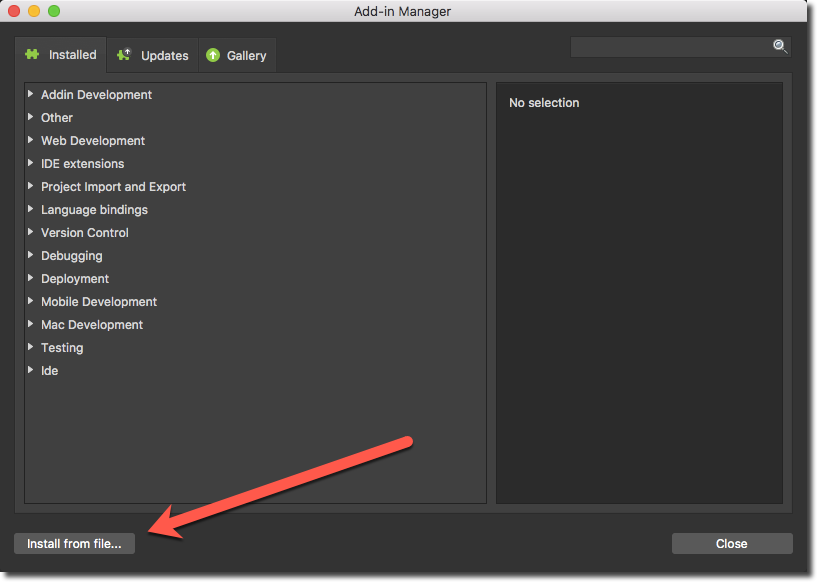
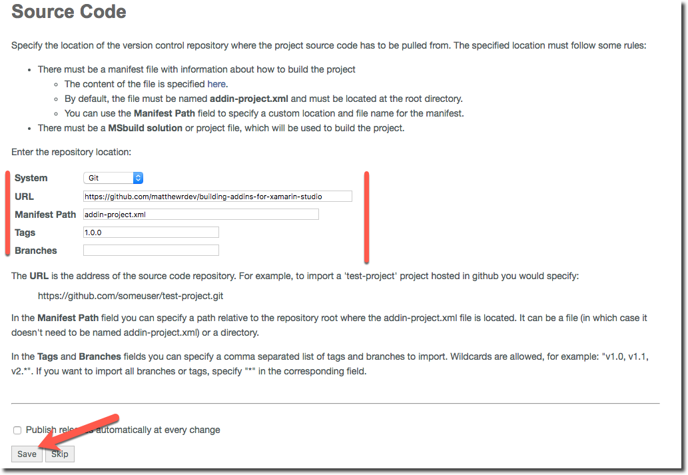
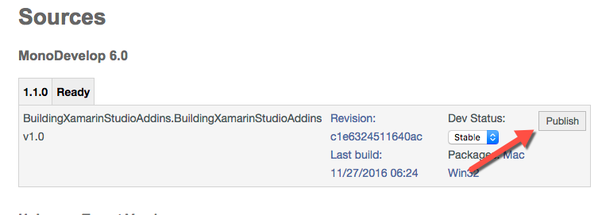
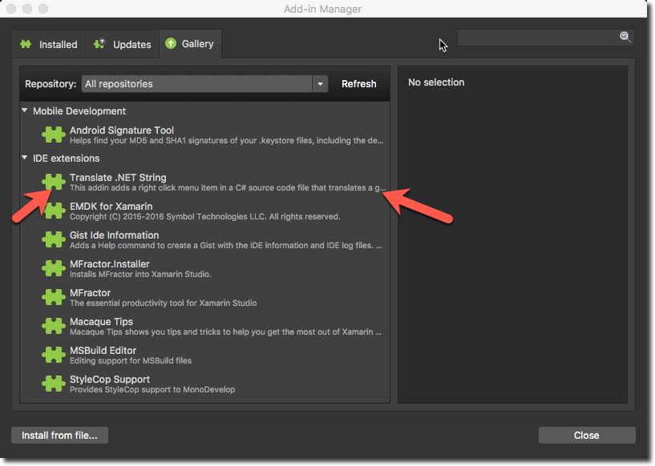

# Building Xamarin Studio Addins
**Matthew Robbins - Creator Of [MFractor](http://www.mfractor.com/)**

This repository is the accompanying source code for the Xamarin University guest lecture, **Building Xamarin Studio Addins**.

Learn how to take an Addin from concept to deployment using the Addin Maker, Xamarin Studio and mdtool.

This source code contains a **Translate String** Addin; users can right click on a C# string literal and translate it to another language!



### Table of Contents

  * Installing the Addin Maker
  * Creating Your First Addin
  * The MonoDevelop Extension Model
  * An Addin Project Structure
  * Some Essential APIs
  * The Translation Addin
  * Testing and Debugging
  * Packaging Your Addin
  * Publishing Your Addin
  * Resources and Docs
  * Summary

## Installing the Addin Maker
Let's get started by installing the Addin Maker into Xamarin Studio.

The Addin Maker is an [open source](https://github.com/mhutch/MonoDevelop.AddinMaker), freely available addin developed by [Mikayla Hutchinson](https://twitter.com/mjhutchinson) that enables development and debugging of Xamarin Studio addins *within* Xamarin Studio itself.

We can install the Addin Maker through Xamarin Studios *Addin Manager*; click on the **Xamarin Studio** main menu then **Addins...** to open the Addin Manager.

Browse to **Gallery**, select the **Addin Development** and then **Addin Maker**:


If the Addin Manager's Gallery is empty (this can happen when you upgrade then downgrade Xamarin Studio), then manually add a reference to the MonoDevelop addin repository using the following URL:

[http://addins.monodevelop.com/Stable/Mac/6.1.1/main.mrep](http://addins.monodevelop.com/Stable/Mac/6.1.1/main.mrep)



## Creating Your First Addin
After installing the Addin Maker, a new project type will be available within the project creation dialog.

Select the **File** main menu item and then **New Solution**. Under **Miscellaneous** an option named **Xamarin Studio Addin** will now be present.



Go ahead and create your first addin!

## The MonoDevelop Extension Model
Before we get coding, it's very important to cover some theory.

MonoDevelop is built upon an extensible architecture known as an *Extension Model*. This architecture uses *Extension Path* to allow third party libraries to extend behavior within the main application. An extension path is syntactically formatted as a *root canonical path* that refers to the application, library and behavior being extended.

For example, the source editor addin in Xamarin Studio exposes the *Extension Path* `/MonoDevelop/SourceEditor2/ContextMenu/Editor` that let's third parties inject commands into the right click context menu. In our manifest (discussed later) we can declare new extension paths for third parties and/or inject new behaviour into other extension paths.

An in-depth discussion on the extension model is beyond the scope of this tutorial; for in-depth information please read the [Mono Extensino Model documentation](http://www.mono-project.com/archived/introduction_to_monoaddins/#the-extension-model).

## An Addin Project Structure

You'll see we now have a blank project with a few files under the projects **Properties** folder:


#### Manifest.addin.xml
[Properties/Manifest.addin.xml](BuildingXamarinStudioAddins/Properties/Manifest.addin.xml)

The addin manifest defines what we are extending within Xamarin Studio; without this file our .NET library would be just a plain old assembly to Xamarin Studio! This file **must** be named `Manifest.addin.xml` and be including into the .NET assembly as an `EmbeddedResource`.

Our addin manifest file declares to MonoDevelop / Xamarin Studio *what* our addin extends in the IDE; when Xamarin Studio loads our addin assembly, it inspects for the Manifest.addin.xml embedded resource and loads in our defined behaviour.

Let's take a look at h

The

#### AddinInfo.cs
[Properties/Manifest.addin.xml](BuildingXamarinStudioAddins/Properties/Manifest.addin.xml)

Our projects addin info file contains the assembly level attributes that specifies to the addin maker

#### Addin References
In addition to the standard **References** and **Packages** project references, an addin also has the concept of **Addin References**.

An addin reference declares to Xamarin Studio that are addin *depends* on another addin; this means we extend that addins behaviour using one of the extension paths exposed by that adddin.

For example, say we wanted to inject custom behavior into the right click context menu for the source editor; we'd declare a new extension within our manifest and target the `/MonoDevelop/SourceEditor2/ContextMenu/Editor` extension path like so:

```
<Extension path = "/MonoDevelop/SourceEditor2/ContextMenu/Editor">
  <CommandItem id = "BuildingXamarinStudioAddins.Commands.TranslateString"/>
</Extension>
```

When doing this, even though IntelliSense and the .NET apis for the source code editor may be available in Xamarin Studio we **must** reference the **MonoDevelop.SourceEditor2** addin like so:



If we do not do this, our addin *might* silently fail to load and you'll spend the next hour in frustration before finally finding an obscure log message telling informing you are missing an addin reference. Save yourself the stress and always include addin references as you are using them!

## Some Essential APIS
Before we review the translation addin, let's dig through some of the essential APIs that are used in this addin:

#### CommandHandler
One of the most common objects we'll create when building a Xamarin Studio addin are implementations of `CommandHandler`'s.

A `CommandHandler` is an action that can be executed within a certain context within Xamarin Studio; we register a command handler into an *extension path*, used `Update` to decide if it can execute and finally use `Run` to perform an action.

#### IdeApp
The `MonoDevelop.Ide.IdeApp` static class is your entry point into most of Xamarin Studio. It exposes the `Workbench`, the `Workspace`, various services and life cycle methods such as when the IDE is exiting.

Typically the `IdeApp` class is used to access the `Workbench` and `Workspace`.

#### IdeApp.Workbench
The `Workbench` is used to access the documents that a developer is currently working with. We can load, create, reparse and close documents, access editor pads, access the root ide window and much much more.

One of the most commonly used properties is `ActiveDocument`. This property retrieves the current document that a user is working with. From there, we can grab the C# syntax tree, a users project or solution and then analyse or make changes to their source code.

#### IdeApp.Workspace
The `Workspace` is used to access the general state of the Ide during a user session.

We can open new projects and documents, detect file open, close and editing events and much, much more.

The workspace is most commonly used to detect changes to a users project and documents and then update a state within our addins.

#### RefactoringService
When developing an Addin, we'll often want to make changes to a users source code and have undo-redo history recorded.

The `RefactoringService` allows us to apply changes to a users document and have undo-redo history automatically recorded.

When applying a change, we provide the `RefactoringService` instances of the `MonoDevelop.Refactoring.Change` object that the service should apply.

Some common changes we can perform:
 * `TextReplaceChange`: Replaces a section of text within a document with new content.
 * `SaveProjectChange`: Saves a targetted project.
 * `CreateFileChange`: Creates a new file with the provided content.

The `Change` object is abstract so we can implement our own custom refactoring changes if we'd like.

#### PropertyService
The static class `MonoDevelop.Core.PropertyService` is used to store user configurations for the Ide installation.

The `PropertyService` is commonly used to store configuration settings that are specific to your addin. For instance, we can store a variable that denotes if it was the addins first run using the code below:

````
if (!PropertyService.HasValue("my_addin.is_first_run")
   || PropertyService.Get("my_addin.is_first_run", true))
{
  PropertyService.Set("my_addin.is_first_run", false);
  PropertyService.SaveProperties();
}
````

Here we:
 * Use `HasValue` to determine if a value is stored within the users properties.
 * Use `Get` to retrive a value from the `PropertyService`; note that we can provide a default value to return when there property does exist.
 * Use `Set` to store a new property.
 * Use `SaveProperties` to commit our changes to the properties. You **must** do this to ensure your properties are persisted between Ide sessions.

## The Translation Addin
Let's go over the files within our sample addin and explore what they do:

#### StartupHandler
[StartupHandler.cs](BuildingXamarinStudioAddins/StartupHandler.cs)

The startup handler will detect when the Ide is first opened and perform any startup initialisation logic. It implements `MonoDevelop.Ide.CommandHandler` and is is injected into the *extension path* `/MonoDevelop/Ide/StartupHandlers` within the manifest.

When the Ide starts up, it will collect all commands in that extension point and invoke the `Run` method.

In this addin, we check to see if the user has a translation api key set and show our configuration dialog if they haven't.

#### TranslateStringCommand
[Commands/TranslateStringCommand.cs](BuildingXamarinStudioAddins/Commands/TranslateStringCommand.cs)

The translate string command is injected into the right click context menu using the `/MonoDevelop/Ide/StartupHandlers`

#### ConfigureApiKeyCommand
[Commands/ConfigureApiKeyCommand.cs](BuildingXamarinStudioAddins/Commands/ConfigureApiKeyCommand.cs)

th


#### ConfigureApiKeyDialog
[Dialogs/ConfigureApiKeyDialog.cs](BuildingXamarinStudioAddins/Dialogs/ConfigureApiKeyDialog.cs)

#### SyntaxTokenHelper
[Helpers/SyntaxTokenHelper.cs](BuildingXamarinStudioAddins/Helpers/SyntaxTokenHelper.cs)

The syntax token helper class is used to inspect the C# syntax tree and retrieve a string literal syntax node that is beneath the users cursor.

Importantly, this class demonstrates:

 * Retrieving the Roslyn analysis document from a MonoDevelop gui document.
 * Inspecting the Abstract Syntax Tree and locating the `SyntaxNode` at a specified location.
 * Inspecting a `SyntaxNode` type and checking if it is a string literal.

This class offers a *tiny* peek into what can be accomplished using Roslyn.

#### TranslationHelper
[Helpers/TranslationHelper.cs](BuildingXamarinStudioAddins/Helpers/TranslationHelper.cs)

#### ExtensionPointHelper
[Helpers/ExtensionPointHelper.cs](BuildingXamarinStudioAddins/Helpers/ExtensionPointHelper.cs)

Given an extension point path such as "/MonoDevelop/Ide/Commands", this helper method retrieves all nodes within that extension and then renders the ids that can be referenced within the Manifest.addin.xml document.

This helper is extremely useful when diagnosing why an addin's command isn't functioning as expected. Frequently another command consumes an event BEFORE your addin; this method let's you insepect an extension path and find the id's of the nodes so you can inject your command before it using the `insertbefore` or `insertafter` attributes.

## Testing And Debugging
When we are ready to test and debug our addin, we can simply press the **Play** button in Xamarin Studio. This will startup our addin within a new Xamarin Studio instance and allow us to debug it as we would *any* other Xamarin Studio application:



You can also select your build profile (such as Debug or Release) as well as adding custom configuration.

## Packaging Your Addin
Once your done debugging your addin and before we send out our addin into the big, wide world it's best practice to verify everything works as a final app package.

Xamarin Studio addins are distributed in the `.mpack` format; this is a zip archive that contains all your Addin assemblies and resources in a convenient bundle.

We use `mdtool` to take an Addin assembly and bundle it into an mpack. On a typical OSX installation, `mdtool` will be location at `/Applications/Xamarin Studio.app/Contents/MacOS/mdtool`.

If `mdtool` is not present at that location, you can find it using the following shell script:

```
find / -name mdtool
```

To package an addin, we use provide the path to our addin assembly to mdtools `setup pack` command along with an output directory using the `-d:` flag like so:

```
/Applications/Xamarin\ Studio.app/Contents/MacOS/mdtool setup pack ./MyAddin/bin/Release/MyAddin.dll -d:./builds
```

This command will generate a `*.mpack` file that bundles your addin. You can then install this addin via the **Addin Manager** using **Install from file**:



For a convenient packaging script, see the [package_mpack.sh](package_mpack.sh) included in this repository.

## Publishing Your Addin
We are almost there!

The last thing we want to do is to include our Addin into the MonoDevelop Addin Repository; this online repository will build, package and host our addin and then make it available within the **Addin Manager** within Xamarin Studio.

Firstly, we need to provide an **addin-project.xml** file that tells the addin repository how to build and then package our addin:

```
<AddinProject appVersion="6.0">
    <Project platforms="Mac Win32">
        <AddinFile>BuildingXamarinStudioAddins/bin/Release/BuildingXamarinStudioAddins.dll</AddinFile>
        <BuildFile>BuildingXamarinStudioAddins.sln</BuildFile>
        <BuildConfiguration>Release</BuildConfiguration>
    </Project>
</AddinProject>
```

Let's go through this line by line:

 * **AddinProject**: This must be the root element and it specifies the app version our addin targets at a minimum. 6.0 means that our addin **will not** be installable on versions of Xamarin Studio lower than 6.0.
 * **Project**: Specify the platforms we are building for.
 * **AddinFile**: Informs the build server where the final assembly it should package will be found relative to the root of our repository.
 * **BuildFile**: The file that the addin server should build.
 * **BuildConfiguration**: The configuration that the addin should be built under.

After we've added this, visit the Addin Repository website and create an account. In the right side of the site click **Create a new project**.

Here we configure the build server and tell where our addin's source code lives, the version control type, where the build configuration may be found and how to handle releases:



For this addin I've chosen to only release the tagged **1.0.0**; this is completely optional. You could have the addin server build and publish each time the repository changes if you so choose to.

Click **Save** and now wait for your addin to build...

After you're addin has been built it will appear under the **Sources** title:



Simply click **Publish** and voila, your addin will appear inside the **Gallery** section of the **Addin Manager** in Xamarin Studio:



## Resources and Documentation
While you're building your shiny addin, you'll often need to consult documentation to figure out how to build what you want...

The bad news here is that most of the APIs are undocumented; you'll frequently need to consult the MonoDevelop source code to figure out how to implement things. The source code for MonoDevelop can be [found here](https://github.com/mono/monodevelop).

Apart from the MonoDevelop source code, here is a list of resource I have found useful when developing [MFractor](http://www.mfractor.com/):

 * [**Introduction to Mono Addins**](http://www.mono-project.com/archived/introduction_to_monoaddins/): An overview of the Mono extension model.
 * [**Extending Xamarin Studio with Add-Ins**](https://developer.xamarin.com/guides/cross-platform/xamarin-studio/customizing-ide/extending_xamarin_studio_with_addins/): A introductory tutorial on building Xamarin Studio addins.
 * [**Extension Tree Reference**](http://www.monodevelop.com/developers/articles/extension-tree-reference/): An in-depth guide to the available extension points within MonoDevelop.

In addition to the existing documentation, here is a non-exhaustive list of some existing addins that can be used as reference material:

 * [**ServiceStack**](https://github.com/ServiceStack/ServiceStackVS): Exposes service stack into Xamarin Studio.
 * [**Addin Maker**](https://github.com/mhutch/MonoDevelop.AddinMaker): The addin maker for Xamarin Studio.
 * [**MonoDevelop Addin Packager**](https://github.com/matthewrdev/monodevelop-addin-packager): (*deprecated*) Helper utility to package the current Xamarin Studio addin project.
 * [**Xamarin.Android Open Layout Declaration**](https://github.com/matthewrdev/xamarin-android-open-layout-definition): (*deprecated*) Shows how to use NRefactory (a *deprecated* syntax tree) to open an android axml layout.
 * [**MFractor.Installer**](https://github.com/matthewrdev/mfractor-installer): An instal;er addin that downloads and injects [MFractor](https://www.mfractor.com) into Xamarin Studio.
 * [**Xamarin.Android String Extractor**](https://github.com/matthewrdev/xamarin-android-string-extractor): (*deprecated*) Shows how to use NRefactory (a *deprecated* syntax tree) to resolve string literal and then extract it into an android string resource file.

*Please note that several of my addins have been deprecated and have moved into MFractor itself. These repositories may not even work anymore and have remained open source for reference only*

I strongly encourage joining the [**Xamarin Studio Addins**](https://xamarinchat.slack.com/archives/xamarin-studio-addins) Slack channel on the Xamarin Slack. I (Matthew Robbins) am generally available to answer questions and help investigate how to implement ideas.

Another option is to reach out directly to me via Twitter; send a tweet to [@matthewrdev](https://twitter.com/matthewrdev) and I'll do my best to help.

## Summary
In this tutorial we've learnt how to install the Addin Maker, built our very first addin, packaged it and then deployed it to the MonoDevelop addin repository.

Good luck and have fun building your own Xamarin Studio addins 🤘

**Matthew Robbins - Creator Of [MFractor](http://www.mfractor.com/)**


